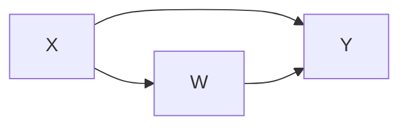
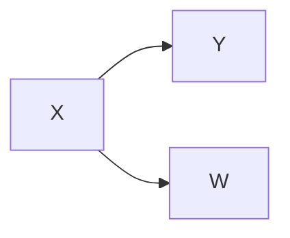
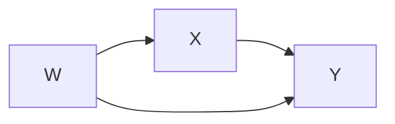

# Preview
This is a preview of my notes on Econometrics. I will update this post as I progress. The notes are based on the lectures by Prof. Peng Wang in Hong Kong University of Science and Technology. I will not copy the content of the lectures directly. Instead, I will try to summarize the key points and add my own thoughts.

# Notes
## Topic 1: Linear Regression and Causal Inference
### Regression Analysis of Causal Model
Causal effects can be identified by regression analysis.
- Assume the observed data is given by {Y_i, X_i, Z_i} for i = 1, ..., n.
- The most simple causal model is the linear regression model:
  - $$Y_i = \beta_0 + \beta_1 X_i + \epsilon_i$$
  - $$\epsilon_i \sim N(0, \sigma^2)$$
  - $$\beta_0, \beta_1$$ are the parameters of the model.
  - $$\epsilon_i$$ is the error term.

This model can be motivated by the potential outcome framework. The model is a simplified version of the following model:
- $$Y_i = Y_i(0) + [Y_i(1) - Y_i(0)] * 1{X_i = 1}  = \beta_0 + \beta_1 X_i + \epsilon_i$$
  - $$\beta_0 = E[Y_i(0)]$$
  - $$\beta_1 = E[Y_i(1) - Y_i(0)]$$
  - $$\epsilon_i = Y_i(0) - E[Y_i(0)]$$
  - $$\epsilon$$ includes the unobserved factors other than $X_i$ that affect $Y_i$.
- if we run a regression of $Y_i$ on $X_i$, the estimator is biased by \epsilon_i, such a bias is called "omitted variable bias". And unobserved factors other than $X_i$ are called "confounders".

- in OLS, let $${\beta_0, \beta_1}$$ be the true parameters of the model, and let $${\hat{\beta_0}$$, $$\hat{\beta_1}}$$ be the OLS estimator.
- The estimator can be defined as 
$$\hat{\beta_1} = \frac{\sum_{i=1}^n (Y_i - \bar{Y})(X_i - \bar{X})}{\sum_{i=1}^n (X_i - \bar{X})^2}$$
- if we have an iid sample, we then have the estimator as
$$\hat{\beta_1} = cov(Y, X) / var(X)$$.
  - iid: independent and identically distributed.

### Unconfundedness
- Confounders: unobserved factors that are correlated with both the treatment. Ignoring them will cause "ommited variable bias".
  - However, if an unobserved factor is not correlated with the treatment, it is not a confounder, and ignoring it will not bias the estimate of the treatment effect. 
  - How to encounter confounders?
    - Control variables
    - Randomized experiments
    - Instrumental variables
  
### Ommited Variable Bias
- Method of Moments is a method to estimate the parameters of a model by matching the moments of the data to the moments of the model.
$$ cov(Y, X) = cov(\beta_0 + \beta_1 X + \epsilon, X) = \beta_1 cov(X, X) + cov(\epsilon, X)$$
- Then we can calculate the bias of the estimator:
$$\hat{\beta_1} - \beta_1 = \frac{cov(\epsilon, X)}{var(X)}$$
- Ommited variable bias is defined as $$cov(\epsilon, X)/var(X)$$, which is non-zero if $X$ is correlated with $\epsilon$.
  - Example if X is a dummy variable, $$var(X) = p(1-p)$$. Then $$cov(\epsilon, X) = E(\epsilon X) - E(\epsilon)E(X) = E(\epsilon X) - E(\epsilon) p = E(\epsilon X) - 0 = E(\epsilon X)$$.
  - We can use law of iterated expectation to get $$cov(\epsilon, X) = E{E(\epsilon X \vert X)} = E{XE(\epsilon \vert X)} = p \cdot E(\epsilon \vert X_i = 1)$$.

- The ommited variable bias implies nonzero selection bias.
  - $$E{Y_i \vert X_i = 1} - E{Y_i \vert X_i = 0} = \beta_1 + E(\epsilon \vert X_i = 1) - E(\epsilon \vert X_i = 0)$$
    - $\beta_1$ is the causal effect. The second term is the selection bias variable bias.
    - $$\epsilon_i = Y_i(0) - E[Y_i(0)] $$.
    - It also implies $$E{Y_i(0)\vertX_i} \neq E{Y_i(0)}$$ or $$E{Y_i(1)\vertX_i} \neq E{Y_i(1)}$$.

## Multiple Regression
- Multiple regression is a generalization of the simple regression model. Assume we have two regressors:
$$Y_i = \beta_0 + \beta_1 X_{i} + \beta_2 W_i + \epsilon_i$$
- $$\beta_1$$ reflects X's direct effect on Y, when W remains the same.

### Statistical thoery of OLS
- Considering a linear regression model with $p$ regressors:
$$Y_i = \beta_0 + \beta_1 X_{i1} + \beta_2 X_{i2} + ... + \beta_p X_{ip} + \epsilon_i$$
- The four least squares assumptions:
  - LSA1: The error term $\epsilon_i$ is normally distributed with mean zero and constant variance $\sigma^2$.
  - LSA2: The error term $\epsilon_i$ is uncorrelated with the regressors $X_{ij}$.
  - LSA3: finite 4th moments.
  - LSA4: no perfect multicollinearity.
- In such case, the OLS estimators are unbiased and consistent and are asymptotically normal.
  - Unbiased: $$E(\hat{\beta_j}) = \beta_j$$
  - Consistent: $$\hat{\beta_j} \rightarrow \beta_j$$
  - Asymptotically normal: $$\hat{\beta_j} \sim N(\beta_j, \sigma^2 / n)$$

### The causal diagram approach
- If the causal relation goes like this: $$X \rightarrow Y$$ or $$W \rightarrow X \rightarrow Y$$ or $$X \rightarrow W \rightarrow Y$$, then we can use the causal diagram approach to estimate the causal effect of X on Y.
- If we have the causal model X both causes X and W, and W causes Y, we have the following:

In this case, we can not control for W, because X affects Y both through W and directly. 

- Another special case goes like:

In such case, Aading W in the regression will reduce the estimation precision. W is redunant regressor.

- If the causal relation goes like:

In this case, we can control for W to get the causal effect of X on Y.

- If we have a case like

