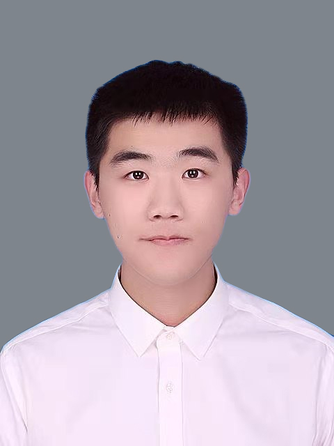

## **Introduction**

My name is Siyuan Jin (金思远). Currently, I am working on Quantum Computing & DLT research at HSBC Lab. My job is to study how to leverage technology to empower business.

---

## **Research Interests**
- **Quantum Computing**: Quantum Finance, Quantum Algorithms
- **Distributed Ledger Technology(DLT)**: Central Bank Digital Currency, Consensus Algorithm

---

## **Education**
- South China University of Technology (Sep 2017 – Jun 2021). B.Eng. in Financial Technology. 
  - GPA: 3.83 / 4.00 
  - Rank: 1 / 33
- Obtained 2020 China National Scholarship

---

## Employment
- HSBC Lab (May 2021 - now). Full Stack Engineer.
- HSBC Lab (Seq 2020 - May 2021). Internship.

---

## Skills
### Language
- Chinese (Native)
- English (Proficient, IELTS 7.5)

---

### **Profile**

{:width="256px"}