This page presents some of my previous moment captures.

### **2024**

#### PhD Conference Gathering, Hong Kong
I participated in PhD Confernece gathering and discussed PhD life with Prof. Hui and peers.
  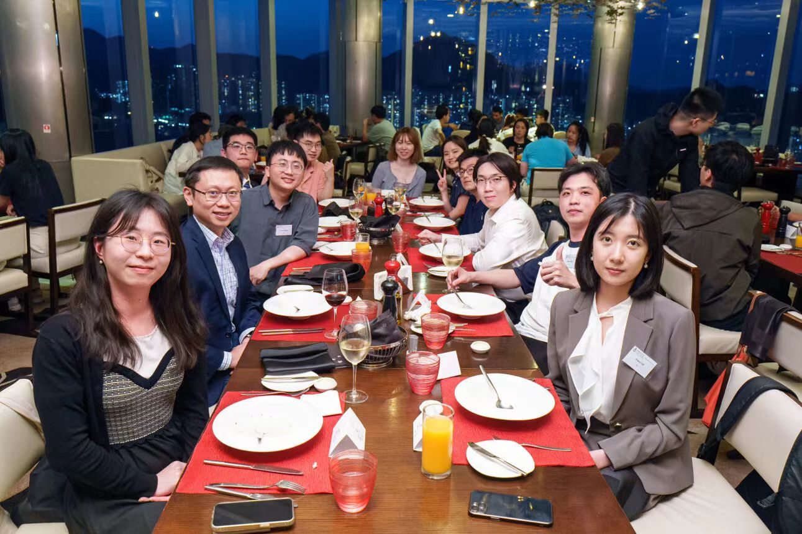

### **2023**

#### e-HKD on-campus trial, Hong Kong
I participated in the e-HKD on-campus trial, and this is a moment capture of the event [[Video]](https://www.linkedin.com/feed/update/urn:li:activity:7160862761130889216/).
  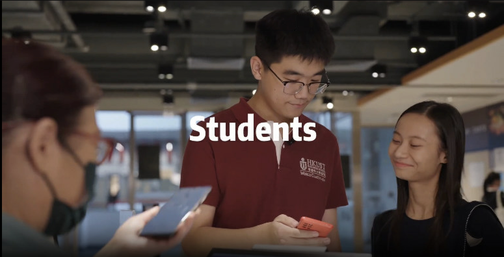

#### First Year Paper Presentation
I presented my first year paper, titled "Token-based Platforms and Green Dillemma".
  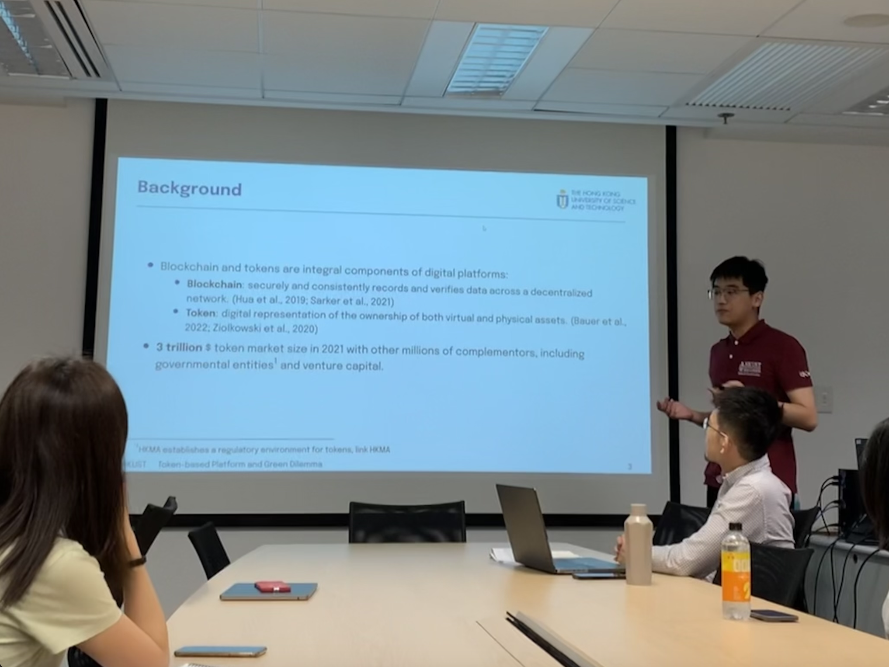

### **2022**

#### HKUST Fintechstic NFT & Metaverse Competition
I was invited to become a mentor for HKUST undergraduate students about their competition on NFT and Metaverse. I am very proud of their achievements. The first picture is the NFT designed by the organizer, and the second picture is a moment capture of my mentorship.

 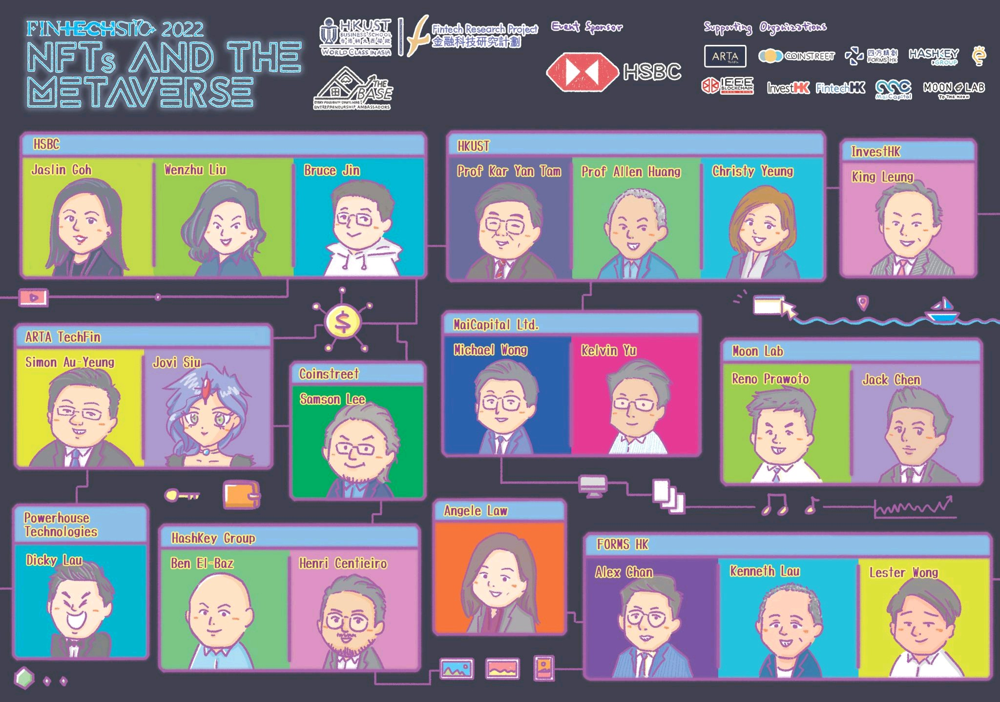

 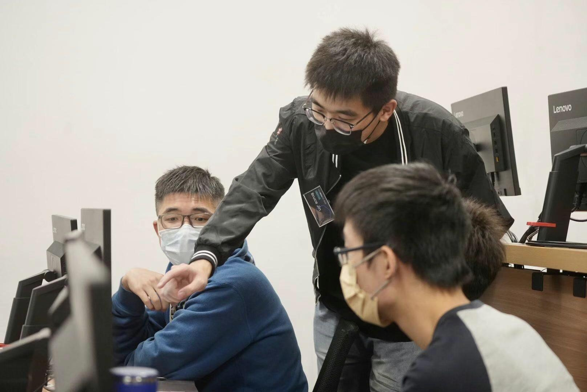

#### HSBC Lab Farewell, Guangzhou, China (me, Dr. Bing Zhu, Dr. Ziyuan Li)
I left HSBC Lab in Guangzhou, China, and this is a moment capture of my farewell. I am very grateful for the opportunity to work with everyone. I learned a lot from them, and I am very proud of our achievements. The first picture is the gift from the team, and the second picture is a NFT photo of Dr. Bing Zhu, Dr. Ziyuan Li, and me.
 
 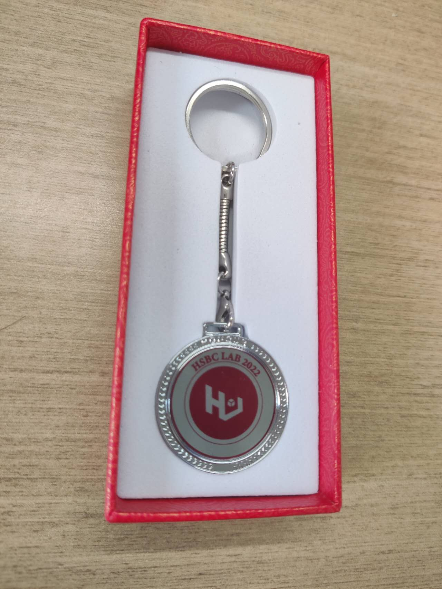
 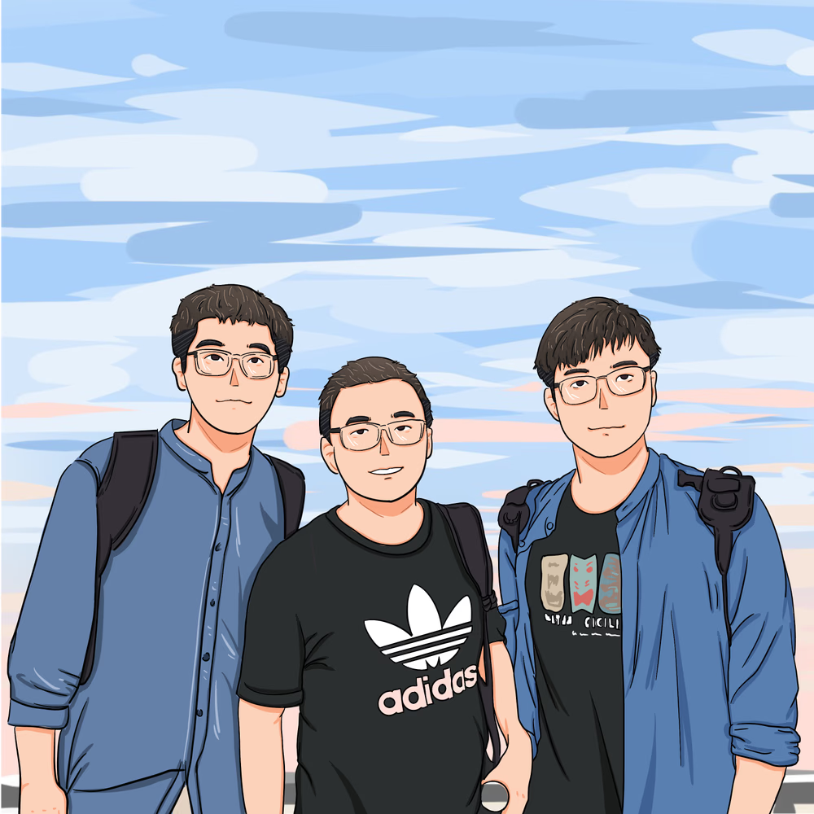

<!-- #### Government Report, Guangzhou, China (Dr. Ziyuan Li, me)
 -->

<!-- #### Skiing, Guangzhou, China (Me, Zhang Yi, Yinzhi Xiong, Dr. Ziyuan Li)
  -->

### **2021**
#### Architecture Summit, Shenzhen, China
I had the opportunity to attend the Architecture Summit in Shenzhen, China, and this is a moment capture of the event.

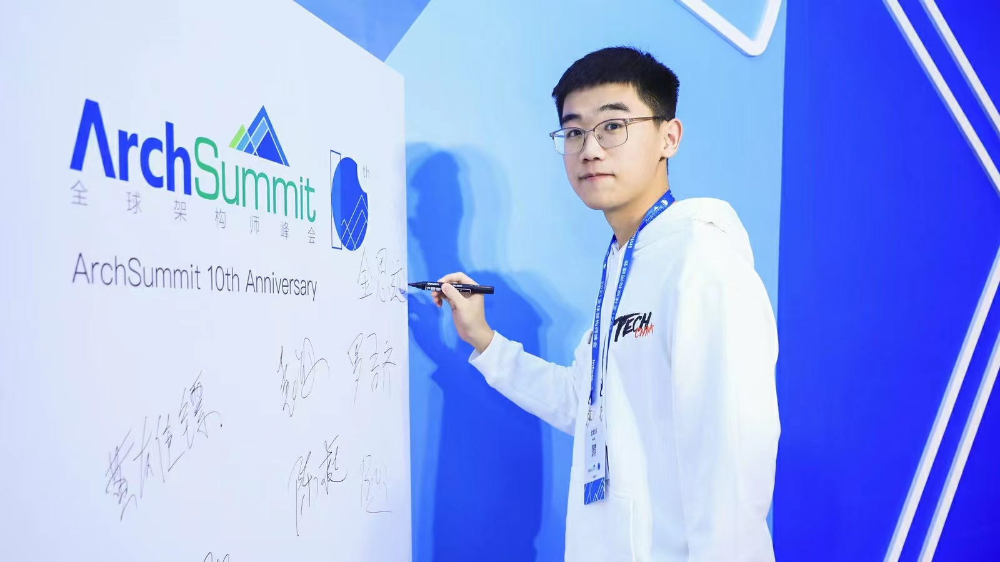
 <!--  -->

#### Alicloud Conference, Hangzhou, China
I had the opportunity to attend the Alicloud Conference in Hangzhou, China, and this is a moment capture of the event with all HSBC staff. 
 <!-- 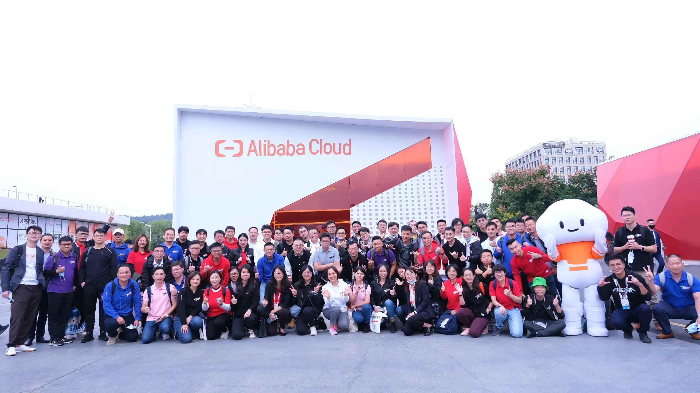 -->

#### Graduation at South China University of Technology
I finally graduated from South China University of Technology, and this is a moment capture by my roommate.
 <!-- 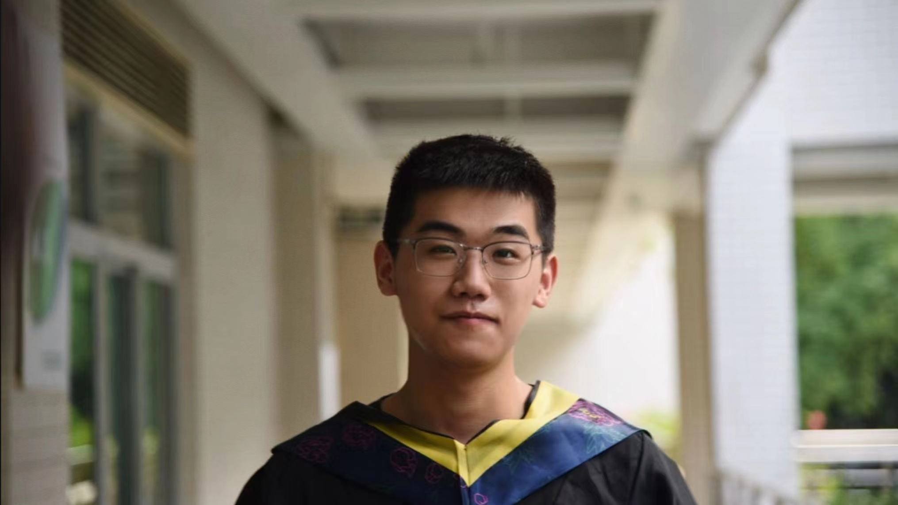 -->

#### Global CBDC Challenge, Online, Singapore Fintech Festival (Dr. Yong Xia, Mark Liu, Me, Bing Qu)
Our HSBC Lab team became the top 15 finalists in the Global CBDC Challenge, and this is a moment capture of our presentation.
<!--  -->

### **2020**
#### Hiking, Huo Luo Mountain, Guangzhou, China (Me, Zhe Li, Wenjiang Quan, Dr. Yong Xia)
I was an intern at HSBC Lab in Guangzhou, China, and this is a moment capture of our hiking.
 <!-- 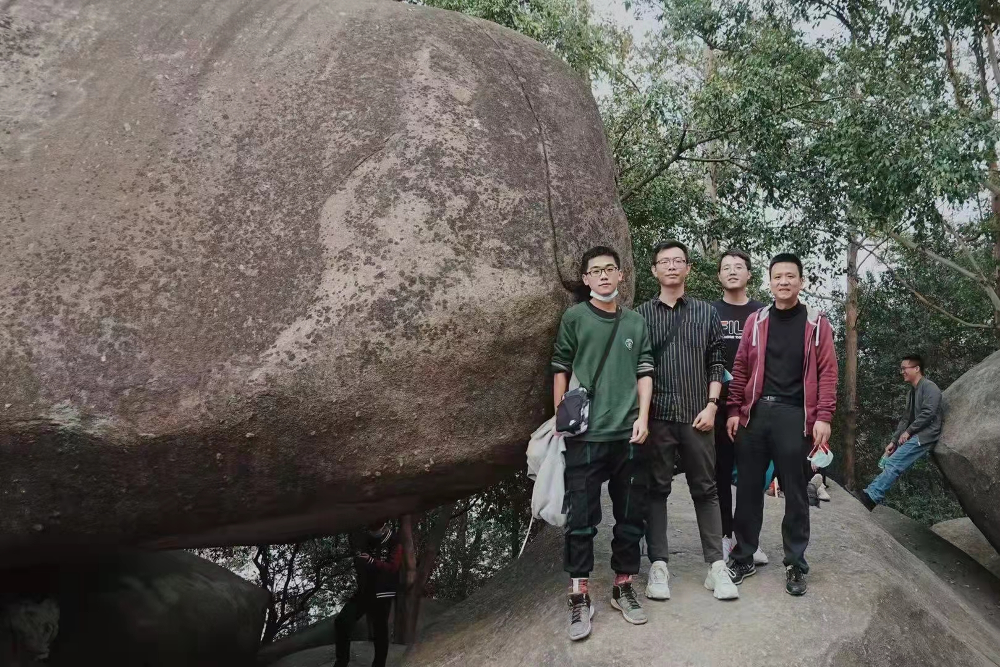 -->

### **2018**
#### School Team Time, Guangzhou, China
I was a basketball player in my undergraduate school, and this is a moment capture of our school team time.
<!-- 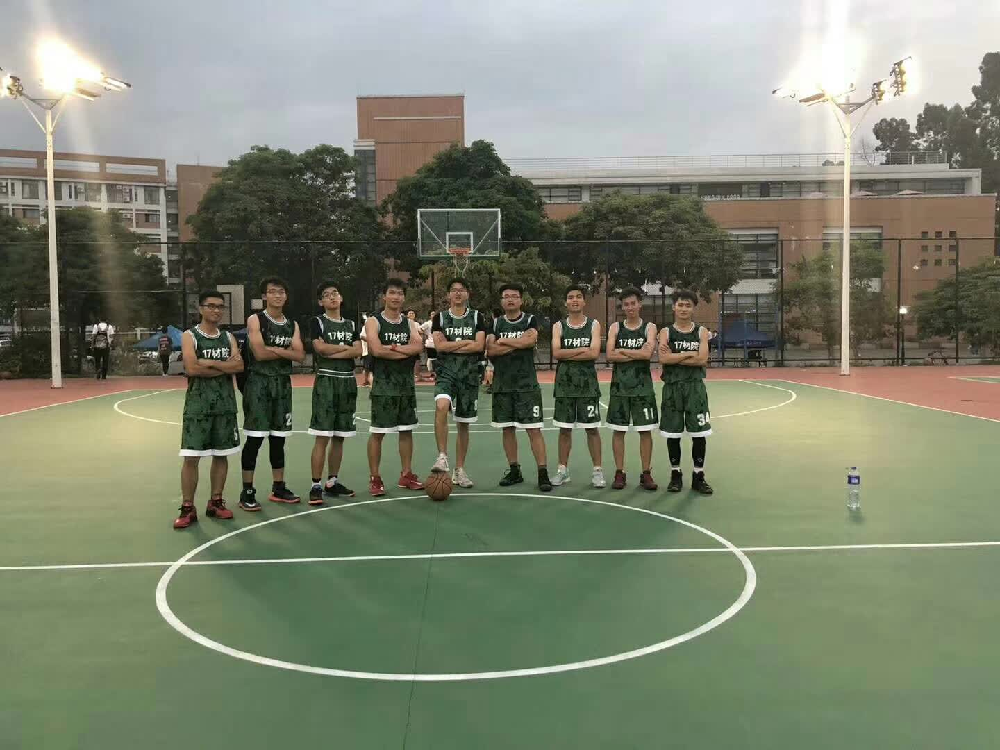 -->

#### Class Team Time, Guangzhou, China
I was a basketball player in my undergraduate class, and this is a moment capture of our class team time.

<!-- 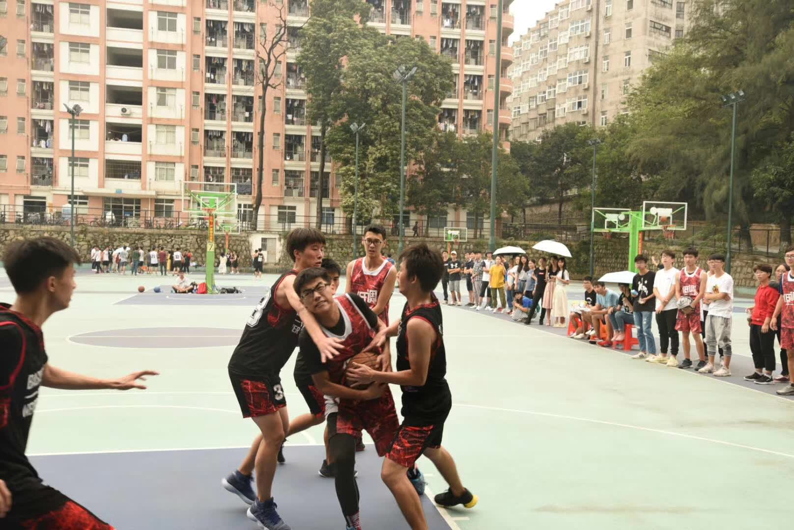 -->
