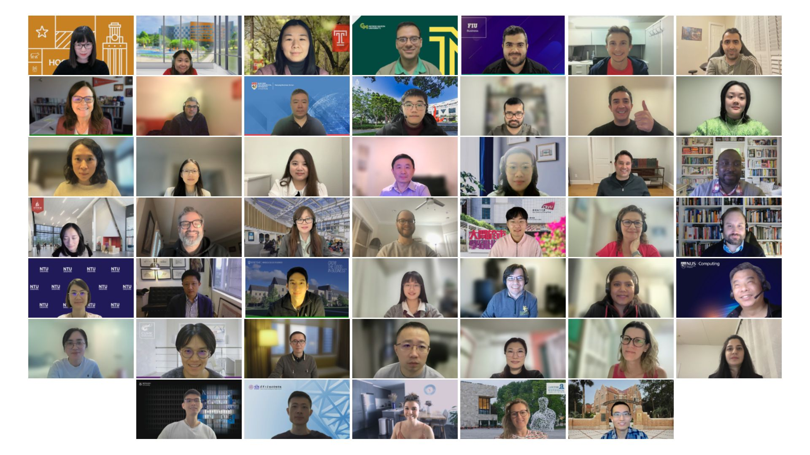
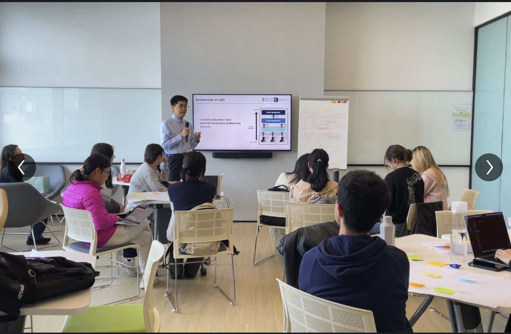
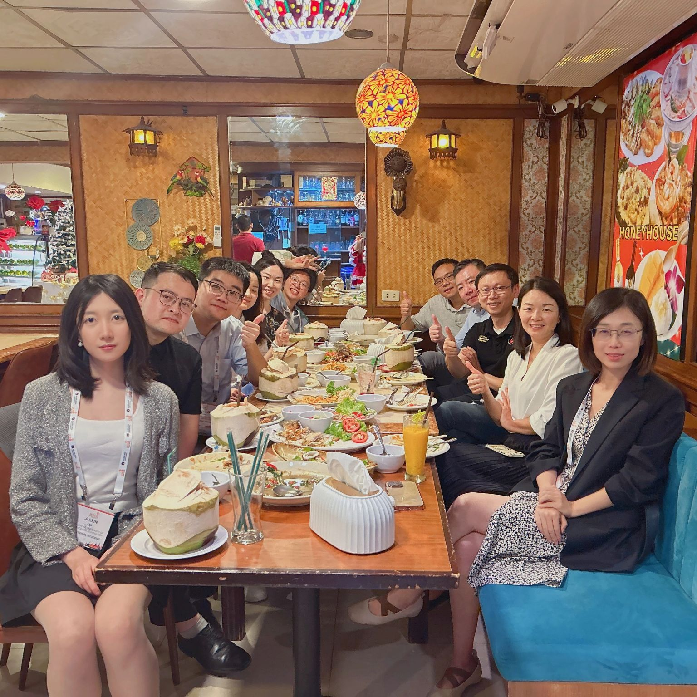
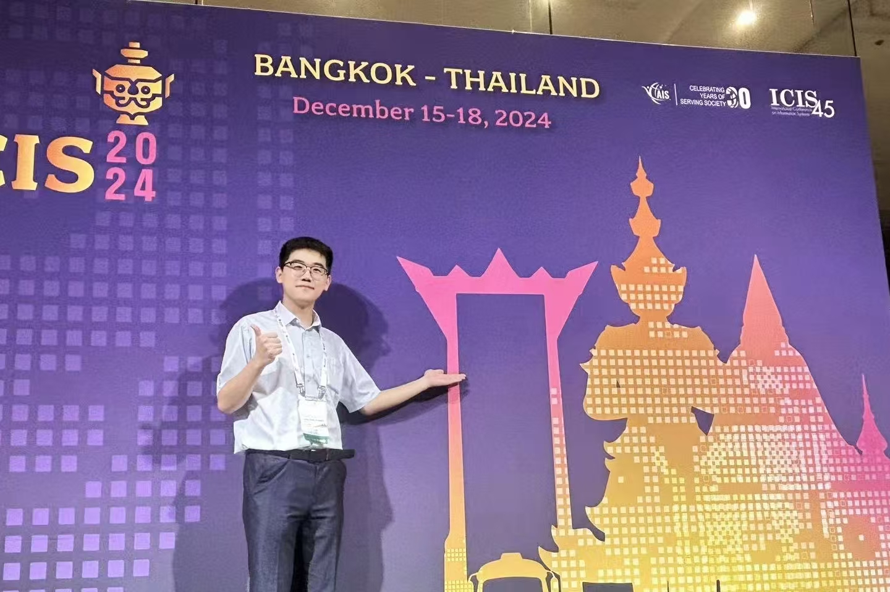
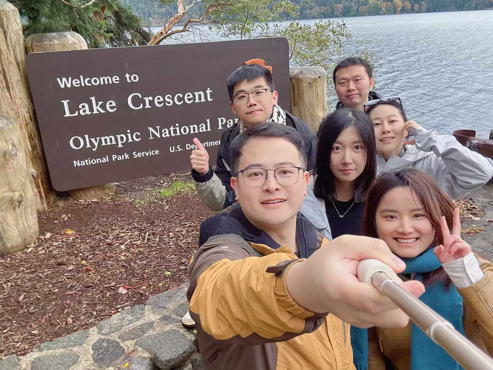
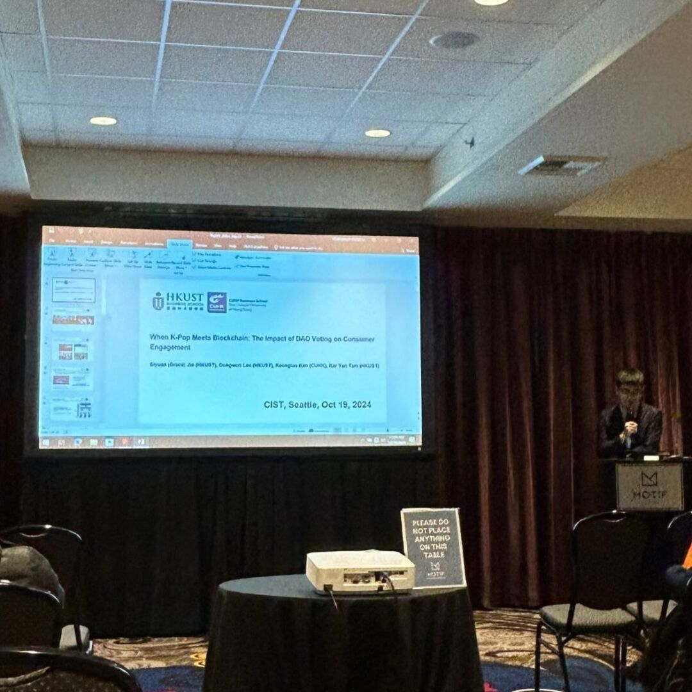

<head>
    <meta charset="UTF-8">
    <meta name="viewport" content="width=device-width, initial-scale=1.0">
  
</head>

  <h1>The story continues to unfold with each new adventure...</h1>

  <h3>2025</h3>
        

            <h4>MISQ Reviewer Virtual Workshop, Online.</h4>
            
We discussed how to review IS papers.

            
        

        

            <h4>Web3Ideathon, Hong KOng</h4>
            
I served as a mentor and shared my work.

            
        

  <h3>2024</h3>
        

            <h4>HKUST PhD Friends Gathering, Bangkok.</h4>
            
We are gathering to celebrate ICIS participation.

            
        

        

            <h4>ICIS Conference, Bangkok - My first ICIS conference.</h4>
            
I presented two works at ICIS.

            
        

        

          <h4>HKUST PhD Students Outdoor Activities, Seattle.</h4>
          
We are walking through National Olympic Park.

          
      

        

          <h4>CIST Presentation, Seattle - My first IS and CIST presentation.</h4>
          
I am presenting the paper titled as "When KPOP meets Blockchain: The Impact of DAO Voting on Consumer Engagement"

          
      

      

          <h4>PhD Conference Gathering, Hong Kong - A remarkable convergence of minds and ideas.</h4>
          
I participated in PhD Conference gathering and discussed PhD life with my academic elder brother Prof. Hui and peers."

          
      

  <h3>2023</h3>
      

          <h4>First Year Paper Presentation, Hong Kong</h4>
          
I presented my first year paper, titled "Token-based Platforms and Green Dillemma"

          
      

      

          <h4> e-HKD on-campus trial, Hong Kong</h4>
          
I was involved in the e-HKD on-campus trial, which was a significant event for digital currency research.

          
      

        <h3>2022</h3>
        

            <h4>HKUST Fintechstic NFT & Metaverse Competition</h4>
            
I was invited to become a mentor for HKUST undergraduate students about their competition on NFT and Metaverse. I am very proud of their achievements. The first picture is the NFT designed by the organizer, and the second picture is a moment capture of my mentorship.

            
            
        

        

            <h4>HSBC Lab Farewell, Guangzhou, China (me, Dr. Bing Zhu, Dr. Ziyuan Li)</h4>
            
I left HSBC Lab in Guangzhou, China, and this is a moment capture of my farewell. I am very grateful for the opportunity to work with everyone. I learned a lot from them, and I am very proud of our achievements. The first picture is the gift from the team, and the second picture is a NFT photo of Dr. Bing Zhu, Dr. Ziyuan Li, and me.

            
            
            
        

    

    

        <h3>2021</h3>

        

            <h4>Architecture Summit, Shenzhen, China</h4>
            
I had the opportunity to attend the Architecture Summit in Shenzhen, China, and this is a moment capture of the event.

            
        

        

            <h4>Alicloud Conference, Hangzhou, China</h4>
            
I had the opportunity to attend the Alicloud Conference in Hangzhou, China, and this is a moment capture of the event with all HSBC staff.

            
        

        

            <h4>Graduation at South China University of Technology</h4>
            
I finally graduated from South China University of Technology, and this is a moment capture by my roommate.

            
        

        

            <h4>Global CBDC Challenge, Online, Singapore Fintech Festival (Dr. Yong Xia, Mark Liu, Me, Bing Qu)</h4>
            
Our HSBC Lab team became the top 15 finalists in the Global CBDC Challenge, and this is a moment capture of our presentation.

            
        

    

    

        <h3>2020</h3>

        

            <h4>Hiking, Huo Luo Mountain, Guangzhou, China (Me, Zhe Li, Wenjiang Quan, Dr. Yong Xia)</h4>
            
I was an intern at HSBC Lab in Guangzhou, China, and this is a moment capture of our hiking.

            
        

    

    

        <h3>2018</h3>

        

            <h4>School Team Time, Guangzhou, China</h4>
            
I was a basketball player in my undergraduate school, and this is a moment capture of our school team time.

            
        

        

            <h4>Class Team Time, Guangzhou, China</h4>
            
I was a basketball player in my undergraduate class, and this is a moment capture of our class team time.

            
        

    
