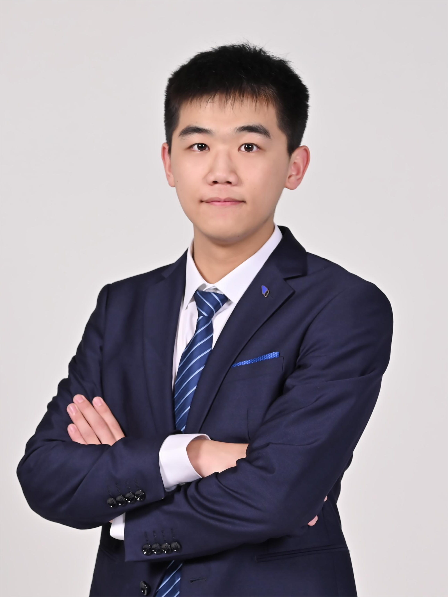

<head>

</head>

  

    
    

   <!-- <em></em> -->

  

    

    <!-- <em>此心光明，亦复何言 - 王阳明 </em> -->
  

    <strong>Siyuan (Bruce) JIN (金思远)</strong> is a fourth-year PhD candidate in HKUST Information Systems (IS) department. He is fortunate to be advised by Prof. <a href="https://isom.hkust.edu.hk/faculty-and-staff/directory/kytam">Kar Yan Tam</a>. 
  

  

    He received the China National Scholarship in 2020, Hong Kong PhD Fellowship (HKPFS) award in 2024, and Young Scientists Program Award in 2025. His papers have been accepted by top IS conferences, including International Conference on Information Systems (ICIS), Conference on Information Systems and Technology (CIST), and Statistical Challenges in Electronic Commerce Research (SCECR). He has contributed to policy papers for the Hong Kong Monetary Authority (HKMA) and has helped secure funding applications <strong>>20 million HKD</strong>. He has organized <strong>>40</strong> IS online PhD student <a href="https://siyuan-bruce.github.io/reading_group/home.html">seminars</a>.
  

  

    Prior to HKUST, he spent two years as a full-stack engineer at HSBC IT Architecture and <a href="https://www.ventures.hsbc.com/en/about-us">HSBC Laboratory</a>, developing <strong>Blockchain</strong> and CBDC projects. His work earned the 2021 Top Performer award, 2021 Role Model honor, and finalist status in the <a href="https://www.mas.gov.sg/news/media-releases/2021/mas-announces-15-finalists-for-the-global-cbdc-challenge">2021 Global CBDC Challenge</a> by the Monetary Authority of Singapore.
  

  

<!-- 
## Upcoming Talks
<ul>  
  <li class="paper-item">
    

      Agentic IT in Information Systems Development: Insights from a Large-Scale Quasi-Experiment on Code Quality
    

    

      <strong>Siyuan Jin</strong>, 
      <a href="https://isom.hkust.edu.hk/faculty-and-staff/directory/kytam">Kar Yan Tam</a>,
      Yong Xia.
    

    
June 23, 2025, 14:45 - 15:45, SCECR 2025, Paphos, Cyprus

    
Session: Short Papers B (Chair: Ioannis Kanellopoulos)

  </li>

  <li class="paper-item">
    

      Crisis, Transparency, and User Engagement
    

    

      <strong>Siyuan Jin</strong>, 
      Yuying Cai, Luying Qiu,
      <a href="https://isom.hkust.edu.hk/faculty-and-staff/directory/kytam">Kar Yan Tam</a>,
    

    
June 24, 2025, 09:00 - 10:15, SCECR 2025, Paphos, Cyprus

    
Session: TRACK 2 - The User Engagement in Digital Platforms (Chair: Michail Batikas)

  </li>
</ul> -->

## News

  

    
Oct, 2025

    

      Paper on Stablecoin's transparency accepted by <strong>CIST 2025</strong>.
    

  

  

    
Jul, 2025

    

      Paper on Copilot's effect accepted by <strong>ICIS 2025</strong>.
    

  

  

    
Jun, 2025

    

      Paper on blockchain-based K-Pop community is selected by
      <strong>HKUST IS Summer Workshop 2025</strong>.
    

  

  

    
Jun, 2025

    

      Our paper on consumer perception of rCBDC adoption was accepted at 
      <strong>
        <a href="https://dl.acm.org/doi/10.1145/3756329" style="text-decoration: underline;">ACM Distributed Ledger Technologies: Research and Practice</a>
      </strong>.
    

  

  

    
Apr, 2025

    

      Paper on code reviewer accepted by <strong>SCECR 2025</strong>.
    

  

  

    
Apr, 2025

    

      Paper on stablecoin transparency accepted by <strong>SCECR 2025</strong>.
    

  

  

    
Apr, 2025

    

      Had a presentation at the <strong>2025 HKUST PhD Student Conference</strong>.
    

  

  

    
Mar, 2025

    

      Selected as a mentor for the <strong>2025 HKUST Web3 Ideathon Competition</strong>.
    

  

  

    
Mar, 2025

    

      Our <strong>IS Reading Group</strong> reached 100+ members!
    

  

  

    
Feb, 2025

    

      Paper on root cause analysis accepted by <strong>AIOps'25</strong>.
    

  

  

    
Dec, 2024

    

      Selected to participate in the <strong>MISQ Reviewer Workshop</strong>.
    

  

  

    
Dec, 2024

    

      Received the HKUST <strong>Young Scientists Program Award (FinTech)</strong>.
    

  

  

    
Nov, 2024

    

      Paper on blockchain-based K-Pop community nominated for the <strong>2024 ICIS Best Short Paper Award</strong>.
    

  

  

    
Nov, 2024

    

      Paper on blockchain infrastructure governance presented at the <strong>2024 Greater Bay Area Finance Workshop</strong>.
    

  

  

    
Aug, 2024

    

      Paper on blockchain-based K-Pop community accepted for publication in <strong>2024 CIST</strong>.
    

  

  

    
Aug, 2024

    

      Paper on code reviewer accepted for publication in <strong>2024 CIST</strong>.
    

  

  

    
Jul, 2024

    

      Paper on blockchain-based K-Pop community accepted by the <strong>2024 ICIS Fintech Track</strong>.
    

  

  

    
Jul, 2024

    

      Paper on stablecoin transparency accepted by the <strong>2024 ICIS</strong>.
    

  

  

    
Jul, 2024

    

      Successfully completed the <strong>PhD Qualification Exam</strong> and advanced to candidacy.
    

  

  

    
Jun, 2024

    

      Paper accepted for the <strong>MIS Quarterly Virtual Paper Development Workshop</strong>.
    

  

  

    
May, 2024

    

      Had a presentation at the <strong>HKUST PhD Student Conference</strong>.
    

  

  

    
Oct, 2023

    

      joint policy paper "e-HKD Pilot Programme" published by <a href="https://www.hkma.gov.hk/media/eng/doc/key-information/press-release/2023/20231030e3a1.pdf"><strong>HKMA</strong></a>.
    

  

  

    
Sep, 2023

    

      Paper related to software metrics distribution accepted by <strong>QRS 2023</strong>.
    

  

  

    
Dec, 2022

    

      Selected as a mentor for the <strong>2022 HKUST Fintechstic Competition</strong>.
    

  

## IS Paper Sharing Group
Inspired by open talks in other subjects, we organize an **information systems** paper sharing series. Our initial targeted audience is mainly PhD students. We also welcome faculty members and industry practitioners to share more advanced topics in this area. You can email me (siyuan.jin@connect.ust.hk) if you want to join us. [[Details]](https://siyuan-bruce.github.io/reading_group/home.html)

<!-- ## **Research Interests**
- **IT Infrastructure (Blockchain)**: Token-based Platforms, Central Bank Digital Currency, Token Economy
- **Software Management**: Software Development
- **Quantum IT Governance**: Quantuam IT management, Quantum Finance, Classical Quantum-Inspired Algorithm -->

<!-- ## **Education**
- **Hong Kong University of Science and Technology** (Aug 2022 - now)
  - MPhil-PhD Student in Information Systems.
  - Supervisor: Prof. [Kar Yan Tam](https://isom.hkust.edu.hk/faculty-and-staff/directory/kytam). -->
  <!-- - Advisors: [Allen H. Huang](https://www.allenhuang.org/), [Dongwon Lee](https://isom.hkust.edu.hk/faculty-and-staff/directory/dongwon), [Kohei Kawaguchi](https://www.kohei-kawaguchi.com/), [Keongtae Kim](https://www.bschool.cuhk.edu.hk/staff/kim-keongtae/), [Marc Dordal i Carreras](https://marcdordal.github.io/), [Qiming Shao](https://sites.google.com/view/sqml/home), [Bei Zeng](https://facultyprofiles.hkust.edu.hk/profiles.php?profile=bei-zeng-zengb). -->
  <!-- - Obtained Hong Kong PhD Fellowship Scheme (2024-2028). -->

<!-- - **South China University of Technology** (Sep 2017 – Jun 2021)
  - B.Fin. in Financial Technology, Outstanding Graduates. 
  - Rank: 1 / 33.
  - Obtained 2021 University-level excellent graduation thesis
  - Obtained 2020 China National Scholarship (Top 0.1%)
  - Obtained 2019 First prize of South China University of Technology (Top 1%)
  - Obtained 2018 First prize of South China University of Technology (Top 1%) -->
<!-- 
## Education

  

    <h3>PhD Candidate in Information Systems, Hong Kong University of Science and Technology</h3>
    <small>Aug 2022 - Present, Clear Water Bay, Hong Kong</small>
    <ul class="timeline">
      <li class="timeline-item">
        Supervisor:&nbsp;<strong>Prof. <a href="https://isom.hkust.edu.hk/faculty-and-staff/directory/kytam">Kar Yan Tam</a></strong>
      </li>
      <li class="timeline-item">
        Hong Kong PhD Fellowship Scheme (2024-2028)
      </li>
    </ul>
  

  

    <h3>Bachelor of FinTech, South China University of Technology</h3>
    <small>Sep 2017 – Jun 2021, Guangzhou, China</small>
        <ul class="timeline">
      <li class="timeline-item">
        China National Scholarship (Top 0.1%)
      </li>
    </ul>
  

## Industry Experience

  

    <h3>Research Consultant, HSBC Hong Kong</h3>
    <small>Sep 2022 - now, Olympian City, Hong Kong</small>
    <ul class="timeline">
      <li class="timeline-item">
      HSBC Email: bruce.s.jin@hsbc.com.hk
      </li>
    </ul>
  

  

    <h3>Full Stack Engineer, HSBC Laboratory</h3>
    <small>May 2021 - Aug 2022, Guangzhou, China</small>
    <ul class="timeline">
      <li class="timeline-item">
        Advisor: Yong Xia
      </li>
      <li class="timeline-item">
        Achievements: 2021 Top Performer, 2021 Role Model, 2021 Global CBDC Challenge Finalist.
      </li>
    </ul>
  

  

    <h3>Trainee, HSBC IT Architecture</h3>
    <small>Sep 2020 - May 2021, Guangzhou, China</small>
  

 -->

## **Contact**
- Email: siyuan.jin@connect.ust.hk

<meta name="viewport" content="width=device-width, initial-scale=1">