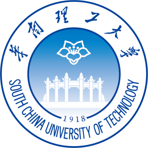

  

    
    

   <!-- <em></em> -->

  

    

    <em>Where there is a will, there is a way.</em>
    

      Siyuan (Bruce) JIN (金思远) is a PhD Candidate in HKUST Information Systems (IS) Department, supervised by Prof. <a href="https://isom.hkust.edu.hk/faculty-and-staff/directory/kytam">Kar Yan Tam</a>. He received China National Scholarship in 2020 and Hong Kong PhD Fellowship (HKPFS) award in 2024. 
  
 
    

      Prior to HKUST, Bruce worked as a software engineer at HSBC IT Architecture and <a href = "https://www.ventures.hsbc.com/en/about-us">HSBC Laboratory</a>. His work has been recognized through several accolades including the 2021 Top Performer award, the 2021 Role Model honor, and <a href = "https://www.mas.gov.sg/news/media-releases/2021/mas-announces-15-finalists-for-the-global-cbdc-challenge">2021 Global Central Bank Digital Currency (CBDC) Challenge finalist</a> hosted by the Monetary Authority of Singapore.
    

  

## News
- **2024-12**: I was nominated for the HKUST **Young Scientists Program Award (FinTech)**.
- **2024-11**: The K-Pop paper was nominated for the **2024 ICIS Best Short Paper Award**.
- **2024-11**: One paper was presented by the **2024 Greater Bay Area Finance Workshop**.
- **2024-09**: Two conditionally accepted paper was accepted by the **2024 ICIS**.
- **2024-08**: Two papers were accepted by the **2024 CIST**.
- **2024-07**: Two papers were conditonally accepted by the **2024 ICIS**.
- **2024-07**: I passed the **PhD Qualification Exam** and became a PhD candidate.
- **2024-06**: One paper was accepted by **MIS Quarterly Virtual Paper Development Workshop**.
- **2024-05**: One paper was selected by **HKUST PhD Student Conference**.
- **2023-10**: Joint policy paper “e-HKD Pilot Programme” was published by [**HKMA**](https://www.hkma.gov.hk/media/eng/doc/key-information/press-release/2023/20231030e3a1.pdf).
- **2022-12**: I was invited to be a mentor for **2022 HKUST Fintechstic Competition**.

## IS Paper Sharing Group
Inspired by open talks in other subjects, we organize an **information systems** paper sharing series. Our initial targeted audience is mainly the beginners in this field, particularly PhD students. We are also targeting more advanced topics in this area by inviting experts in information systems. You can email me (siyuan.jin@connect.ust.hk) if you want to join us. [[Details]](https://siyuan-bruce.github.io/reading_group/home.html)

<!-- ## **Research Interests**
- **IT Infrastructure (Blockchain)**: Token-based Platforms, Central Bank Digital Currency, Token Economy
- **Software Management**: Software Development
- **Quantum IT Governance**: Quantuam IT management, Quantum Finance, Classical Quantum-Inspired Algorithm -->

<!-- ## **Education**
- **Hong Kong University of Science and Technology** (Aug 2022 - now)
  - MPhil-PhD Student in Information Systems.
  - Supervisor: Prof. [Kar Yan Tam](https://isom.hkust.edu.hk/faculty-and-staff/directory/kytam). -->
  <!-- - Advisors: [Allen H. Huang](https://www.allenhuang.org/), [Dongwon Lee](https://isom.hkust.edu.hk/faculty-and-staff/directory/dongwon), [Kohei Kawaguchi](https://www.kohei-kawaguchi.com/), [Keongtae Kim](https://www.bschool.cuhk.edu.hk/staff/kim-keongtae/), [Marc Dordal i Carreras](https://marcdordal.github.io/), [Qiming Shao](https://sites.google.com/view/sqml/home), [Bei Zeng](https://facultyprofiles.hkust.edu.hk/profiles.php?profile=bei-zeng-zengb). -->
  <!-- - Obtained Hong Kong PhD Fellowship Scheme (2024-2028). -->

<!-- - **South China University of Technology** (Sep 2017 – Jun 2021)
  - B.Fin. in Financial Technology, Outstanding Graduates. 
  - Rank: 1 / 33.
  - Obtained 2021 University-level excellent graduation thesis
  - Obtained 2020 China National Scholarship (Top 0.1%)
  - Obtained 2019 First prize of South China University of Technology (Top 1%)
  - Obtained 2018 First prize of South China University of Technology (Top 1%) -->

## Education

  

    <h3>Hong Kong University of Science and Technology</h3>
    <small>Aug 2022 - Present, Clear Water Bay, Hong Kong</small>
    <ul class="timeline">
      <li class="timeline-item">
        PhD Candidate in Information Systems
      </li>
      <li class="timeline-item">
        Supervisor:&nbsp;<strong>Prof. <a href="https://isom.hkust.edu.hk/faculty-and-staff/directory/kytam">Kar Yan Tam</a></strong>
      </li>
      <li class="timeline-item">
        Hong Kong PhD Fellowship Scheme (2024-2028)
      </li>
    </ul>
  

  <!--  -->

  

    <h3>South China University of Technology</h3>
    <small>Sep 2017 – Jun 2021, Guangzhou, China</small>
    <ul class="timeline">
      <li class="timeline-item">
        B.Fin. in Financial Technology, Rank: 1 / 33, Outstanding Graduates
      </li>
      <li class="timeline-item">
        2021 University-level excellent graduation thesis
      </li>
      <li class="timeline-item">
        2020 China National Scholarship (Top 0.1%)
      </li>
      <li class="timeline-item">
        2018, 2019 University-level First Prize (Top 1%)
      </li>
    </ul>
  

  <!--  -->

## Industry Consulting
<!-- - **HSBC Hong Kong** (Sep 2022 - now)
  - Research Work in CBDC, Quantum Finance, AI, and Software Engineering.
  - Seven patents are already filed.
  - HSBC Email: bruce.s.jin@hsbc.com.hk -->

  

    <h3>HSBC Hong Kong</h3>
    <small>Sep 2022 - now, Olympian City, Hong Kong</small>
    <ul class="timeline">
      <li class="timeline-item">
        Research in CBDC, AI, and Software Engineering.
      </li>
      <li class="timeline-item">
      HSBC Email: bruce.s.jin@hsbc.com.hk
      </li>
    </ul>
  

  <!--  -->

## **Employment**
<!-- - **HSBC Laboratory** (May 2021 - Aug 2022)
  - Permanent Full Stack Engineer on Quantum Computing & CBDC Research
  - Advisor: Yong Xia
  - 2021 Top Performer \| 2021 Role Model \| 2021 Global CBDC Challenge Finalist \| Interviewed many PhDs for quantum scientists
  - Central Bank Digital Currency (E-CNY \| E-HKD) \| Stablecoin \| ESG \| Quantum Portfolio Optimization

- **HSBC IT Architecture** (Sep 2020 - May 2021)
  - Internship on CBDC work
  - Advisor: Yong Xia
  - Angle Fund Winner \| Corda Prototype Development -->

  

    <h3>HSBC Laboratory</h3>
    <small>May 2021 - Aug 2022, Guangzhou, China</small>
    <ul class="timeline">
      <li class="timeline-item">
        Full Stack Engineer
      </li>
      <li class="timeline-item">
        Advisor: Yong Xia
      </li>
      <li class="timeline-item">
        Achievements: 2021 Top Performer, 2021 Role Model, 2021 Global CBDC Challenge Finalist.
      </li>
      <li class="timeline-item">
        Key Areas: Central Bank Digital Currency (E-CNY, E-HKD), Stablecoin, ESG, Quantum Portfolio Optimization.
      </li>
    </ul>
  

  

    <h3>HSBC IT Architecture</h3>
    <small>Sep 2020 - May 2021, Guangzhou, China</small>
    <ul class="timeline">
      <li class="timeline-item">
        Internship.
      </li>
      <li class="timeline-item">
        Advisor: Yong Xia
      </li>
      <li class="timeline-item">
        Achievements: Angle Fund Winner.
      </li>
        <li class="timeline-item">
        Key Areas: Central Bank Digital Currency (E-CNY).
      </li>
      <li class="timeline-item">
        Skills: Corda Prototype Development.
      </li>
    </ul>
  

  
<!-- ## **Awards**
- Sep 2022: HKUST PhD Postgraduate Studentship
- Nov 2021: [Global CBDC Challenge Finalist](https://www.mas.gov.sg/news/media-releases/2021/mas-announces-15-finalists-for-the-global-cbdc-challenge?fbclid=IwAR0B9v-5FBSXcnr61edLVwEch-jJ5EV8-pSJwYe00erQdS8rGreTtZIYABY) (Top 5% in over 300+ submissions from 50+ countries)
- Jun 2021: Outstanding Graduates \| University-level excellent graduation thesis (Top 1%) -->

## Language
- Mandarin (Native)
- English (Proficient, IELTS 7.5 (9))
- Cantonese (Beginner)
  
## **Contact**
I am open to co-start any interesting topics related to blockchain and IT governance. Please feel free to contact me.
- Email: siyuan.jin@connect.ust.hk

<meta name="viewport" content="width=device-width, initial-scale=1">
