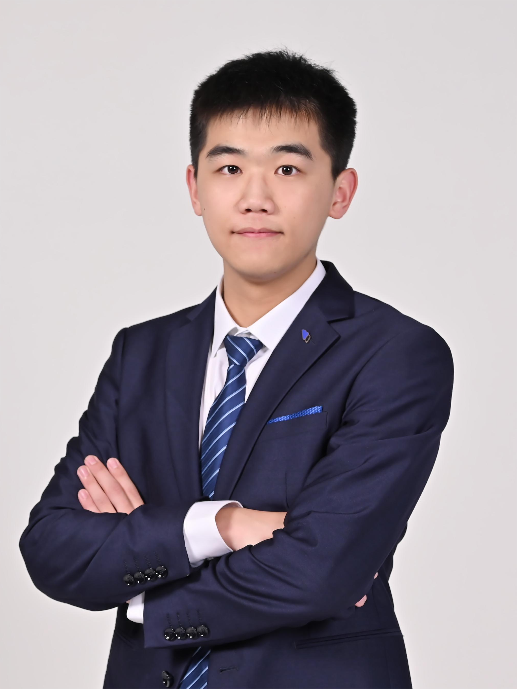

<head>

</head>

  

    
    

      
Siyuan (Bruce) Jin (金思远)

      

        &#127979;
        <strong>HKUST</strong> &middot; PhD Candidate, Information Systems
      

      

        &#127963;
        <strong>Wharton</strong> &middot; Visiting Scholar (through Dec 2026)
      

      

        Email
        <a href="mailto:siyuan.jin@connect.ust.hk">siyuan.jin@connect.ust.hk</a>
      

      

        <a href="https://github.com/siyuan-bruce" target="_blank" rel="noopener noreferrer">GitHub</a>
        <a href="https://www.linkedin.com/in/si-yuan-bruce-jin" target="_blank" rel="noopener noreferrer">LinkedIn</a>
        <a href="https://siyuan-bruce.github.io/research.html">Research</a>
        <a href="/service.html">Service</a>
      

    

  

    

     

    <strong>Siyuan (Bruce) JIN (金思远)</strong> is a PhD candidate in Information Systems at HKUST Business School, advised by Prof. <a href="https://isom.hkust.edu.hk/faculty-and-staff/directory/kytam">Kar Yan Tam</a>. He is currently a visiting scholar at the Wharton School, University of Pennsylvania, working with Prof. Lynn Wu until December 2026.
  

  

    His research interests center on 1) blockchain infrastructure and application governance and 2) AI use in enterprise IT management. His methods include data analytics, econometrics, and experimental methods. 
    His papers have been accepted by top IS conferences, including ICIS, CIST, and SCECR. His papers are nominated as best paper of ICIS 2024 and ICIS 2025. He has contributed to policy papers for the Hong Kong Monetary Authority (HKMA) and HKET (經濟日報), and has industrial collaboration with HSBC, NetEase, Shanbei, and other companies.

    He received the China National Scholarship (2020), Hong Kong PhD Fellowship (HKPFS) (2024), and Young Scientists Program Award (2025). He was also awarded the 2025 NSFC Young Student Basic Research Program Grant (300,000 RMB). Through the <a href="/service.html">IS Reading Group</a>, he has organized 40+ online IS PhD student seminars. 
    
  

  

    Before HKUST, he worked for two years at HSBC as a trainee and full-stack engineer, focusing on blockchain projects in IT Architecture and the <a href="https://www.ventures.hsbc.com/en/about-us">HSBC Laboratory</a>. He received the 2021 Top Performer and Role Model awards, and was a finalist in the <a href="https://www.mas.gov.sg/news/media-releases/2021/mas-announces-15-finalists-for-the-global-cbdc-challenge">2021 Global CBDC Challenge</a> organized by the Monetary Authority of Singapore.
  

  

## News

  

    
Dec, 2025

    

      Received the Best Reviewer Award at <strong>2025 ICIS</strong>.
    

  

  

    
Dec, 2025

    

      Received the 2025 NSFC Young Student Basic Research Program (PhD Student) Grant (2026-2027, 300K RMB).
    

  

  

    
Dec, 2025

    

      Paper on seniority and AI-augmented code contributions nominated for the <strong>ICIS 2025 Best Paper Award</strong>.
    

  

  

    
Oct, 2025

    

      Paper on stablecoin transparency accepted at <strong>CIST 2025</strong>.
    

  

  

    
Jul, 2025

    

      Paper on Copilot's impact accepted at <strong>ICIS 2025</strong>.
    

  

  

    
Jun, 2025

    

      Paper on blockchain-based K-Pop community selected for the <strong>HKUST IS Summer Workshop 2025</strong>.
    

  

  

    
Jun, 2025

    

      Paper on consumer perception of rCBDC adoption accepted at 
      <strong>
        <a href="https://dl.acm.org/doi/10.1145/3756329" style="text-decoration: underline;">ACM Distributed Ledger Technologies: Research and Practice</a>
      </strong>.
    

  

  

    
Apr, 2025

    

      Paper on code review accepted at <strong>SCECR 2025</strong>.
    

  

  

    
Apr, 2025

    

      Paper on stablecoin transparency accepted at <strong>SCECR 2025</strong>.
    

  

  

    
Apr, 2025

    

      Presented at the <strong>2025 HKUST PhD Student Conference</strong>.
    

  

  

    
Mar, 2025

    

      Selected as a mentor for the <strong>2025 HKUST Web3 Ideathon Competition</strong>.
    

  

  

    
Mar, 2025

    

      <strong>IS Reading Group</strong> reached over 100 members.
    

  

  

    
Feb, 2025

    

      Paper on root cause analysis accepted at <strong>AIOps 2025</strong>.
    

  

  

    
Dec, 2024

    

      Selected to participate in the <strong>MISQ Reviewer Workshop</strong>.
    

  

  

    
Dec, 2024

    

      Received the <strong>HKUST Young Scientists Program Award (FinTech)</strong>.
    

  

  

    
Nov, 2024

    

      Paper on blockchain-based K-Pop community nominated for the <strong>ICIS 2024 Best Short Paper Award</strong>.
    

  

  

    
Nov, 2024

    

      Presented research on blockchain infrastructure governance at the <strong>2024 Greater Bay Area Finance Workshop</strong>.
    

  

  

    
Aug, 2024

    

      Paper on blockchain-based K-Pop community accepted for publication in <strong>2024 CIST</strong>.
    

  

  

    
Aug, 2024

    

      Paper on code review accepted for publication in <strong>2024 CIST</strong>.
    

  

  

    
Jul, 2024

    

      Paper on blockchain-based K-Pop community accepted at the <strong>2024 ICIS Fintech Track</strong>.
    

  

  

    
Jul, 2024

    

      Paper on stablecoin transparency accepted at <strong>2024 ICIS</strong>.
    

  

  

    
Jul, 2024

    

      Successfully passed the <strong>PhD Qualification Exam</strong> and advanced to candidacy.
    

  

  

    
Jun, 2024

    

      Paper accepted for the <strong>MIS Quarterly Virtual Paper Development Workshop</strong>.
    

  

  

    
May, 2024

    

      Presented at the <strong>HKUST PhD Student Conference</strong>.
    

  

  

    
Oct, 2023

    

      Joint policy paper "e-HKD Pilot Programme" published by the <a href="https://www.hkma.gov.hk/media/eng/doc/key-information/press-release/2023/20231030e3a1.pdf"><strong>HKMA</strong></a>.
    

  

  

    
Sep, 2023

    

      Paper on software metrics distributions accepted at <strong>QRS 2023</strong>.
    

  

  

    
Dec, 2022

    

      Selected as a mentor for the <strong>2022 HKUST Fintechstic Competition</strong>.
    

  

## Contact

  
Siyuan (Bruce) Jin (金思远)

  
PhD candidate in Information Systems, HKUST Business School · Visiting scholar, Wharton School, University of Pennsylvania (through December 2026)

  <ul>
    <li><strong>Email:</strong> <a href="mailto:siyuan.jin@connect.ust.hk">siyuan.jin@connect.ust.hk</a> — research collaboration, reading group, RA applications, and general inquiries</li>
    <li><strong>LinkedIn:</strong> <a href="https://www.linkedin.com/in/si-yuan-bruce-jin" target="_blank" rel="noopener noreferrer">linkedin.com/in/si-yuan-bruce-jin</a></li>
  </ul>

<meta name="viewport" content="width=device-width, initial-scale=1">