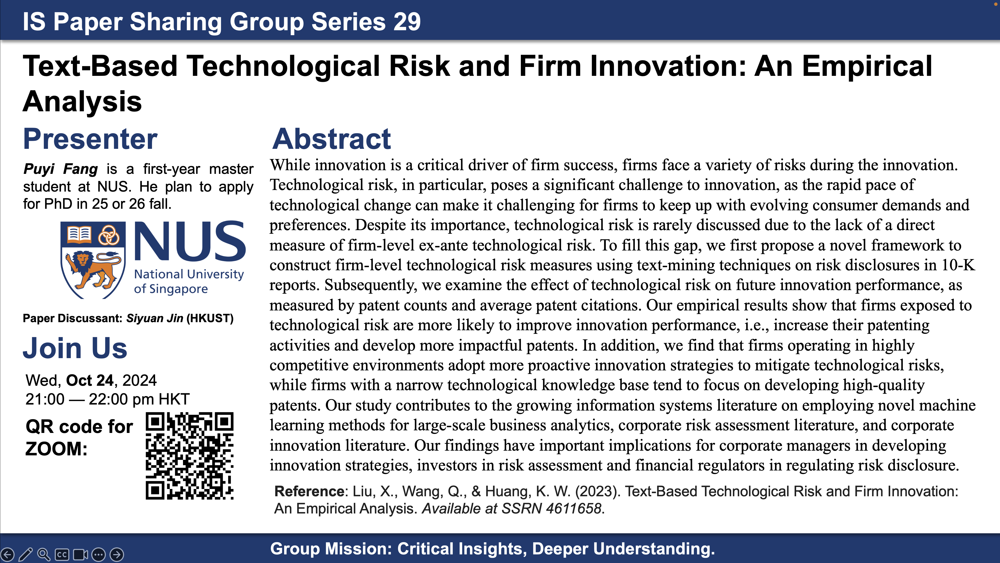

<head>
    <meta charset="UTF-8">
    <meta name="viewport" content="width=device-width, initial-scale=1.0">
    <title>Information Systems Paper Sharing Group (PSG)</title>
    
</head>
<body>

  

      <h1>Welcome to the Information Systems Paper Sharing Group (PSG)</h1>
      
Inspired by the spirit of open academic discussion, the Information Systems Paper Sharing Group (PSG) aims to foster an environment where scholars can exchange ideas and critically engage with academic papers in the field of Information Systems.

      <h2>Purpose</h2>
      
This series is primarily designed for beginners, including pre-doctoral and PhD students, who are eager to deepen their understanding of Information Systems. We also welcome the participation of senior scholars to enrich discussions and offer their expertise. Each participant is encouraged to provide constructive critiques of the presentations, contributing to a vibrant and dynamic academic community.

      
For suggestions or inquiries, please contact Bruce at <a href="mailto:bruce.s.y.jin@gmail.com">bruce.s.y.jin@gmail.com</a>.

      <h2>Acknowledgement</h2>
      
The PSG was initiated by myself and Zhe Wang from PolyU, with Tonglin Zhang contributing to the design of our posters.

      <h2>Meeting Details</h2>
      
<strong>Time:</strong> Tuesdays, 9:00 - 10:00 PM (HKT)

      
<strong>Zoom Link:</strong> <a href="https://hkust.zoom.us/j/92295593514?pwd=L1o2SjNVVGFhTk9jUEk1RDlUbHBEQT09">Join the Meeting</a>

      
<strong>Language:</strong> English/Chinese (depending on the preference of the presenter)

      
<strong>Format:</strong> A 45-minute main presentation followed by a 15-minute discussion session

      <h2>Past Sessions</h2>
      

        
        
        
        
        
        
        
        
        
        
        
        
        
        
        
        
        
        
        
        
      

      
Join us to expand your knowledge of Information Systems through engaging discussions and thoughtful critiques!

  

</body>