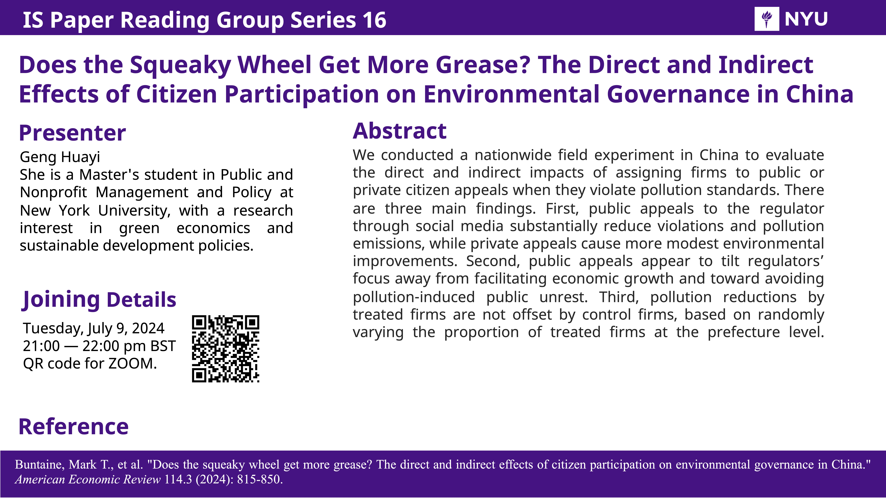
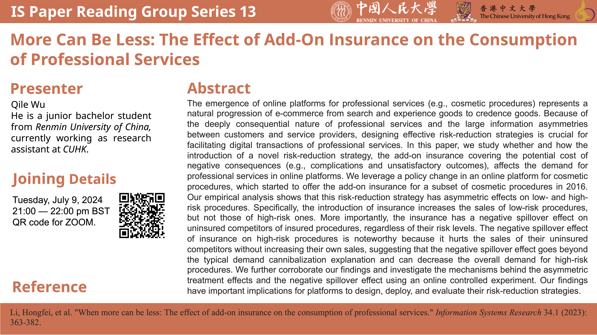
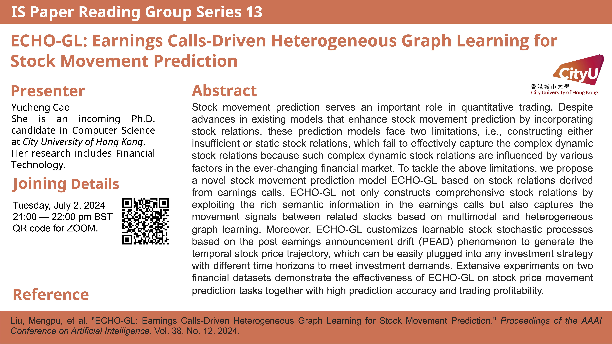
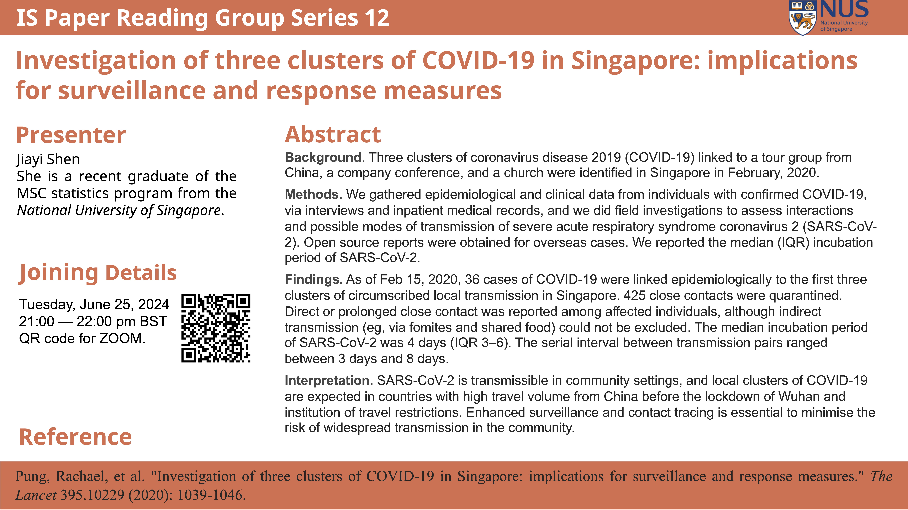
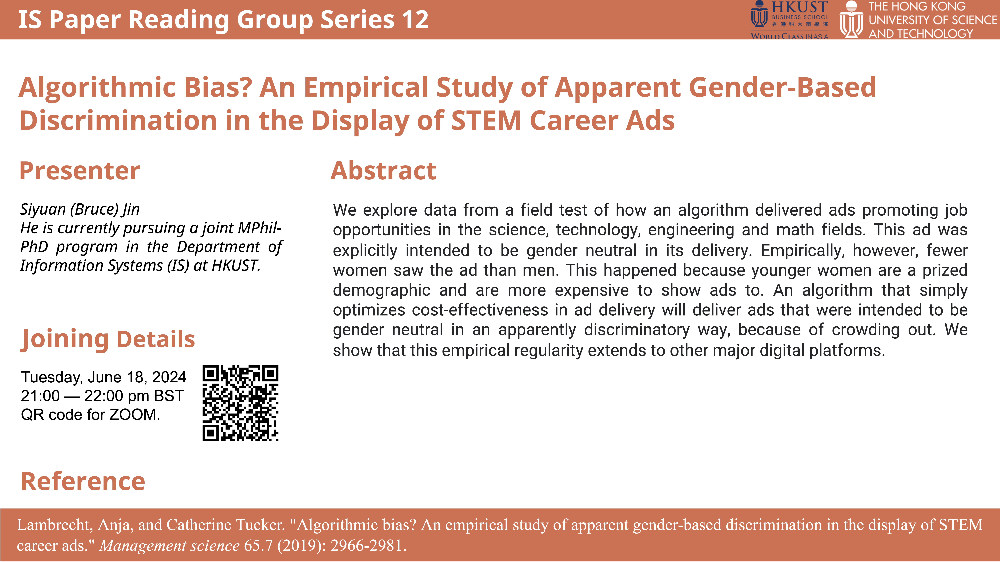

Welcome to the **Information Systems Paper Sharing Group (PSG)**! Inspired by open discussions across various subjects, we have organized a series dedicated to sharing and critiquing academic papers in the field of Information Systems.

## Purpose
Our initial target audience consists mainly of beginners, particularly pre-doc and PhD students. We also aim to invite senior scholars in the Information Systems domain. Each participant is encouraged to provide serious critiques of the presentations.

If you have any suggestions, feel free to contact Bruce at [bruce.s.y.jin@gmail.com](mailto:bruce.s.y.jin@gmail.com).

## Acknowledgement
- The initial group is initiated by me and Zhe Wang from PolyU. Tonglin Zhang assisted in poster making. 

## Meeting Details
- **Time:** Every Tuesday, 9:00 - 10:00 PM (HKT)
- **Zoom Link:** [Join Meeting](https://hkust.zoom.us/j/92295593514?pwd=L1o2SjNVVGFhTk9jUEk1RDlUbHBEQT09)
- **Language:** English/Chinese, depending on presenter's preference
- **Format:** 45-minute main presentation, followed by a 15-minute mini session

## Past Sessions

Join us to enrich your understanding of Information Systems through insightful discussions and critiques!

